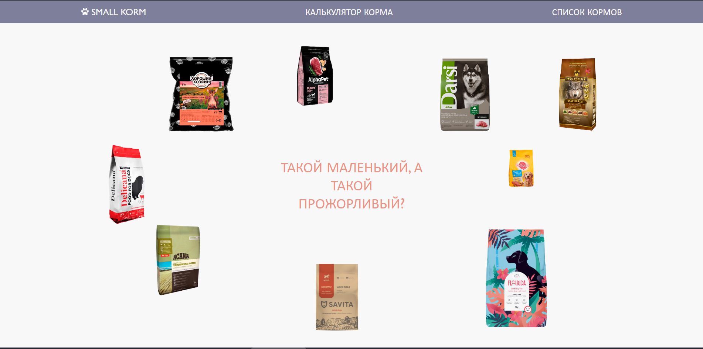
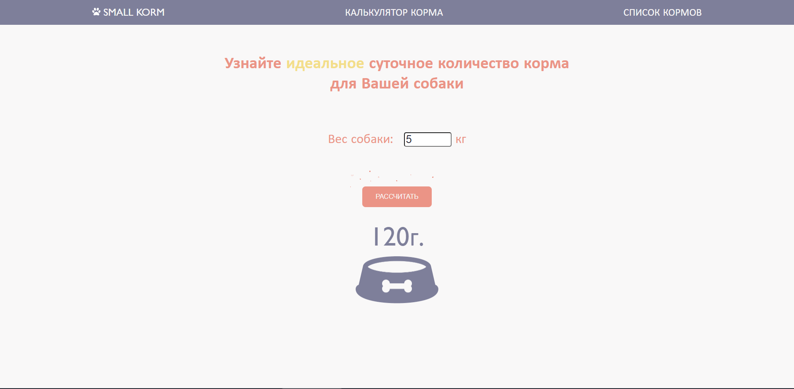

# Small Korm

Small Korm - это проект про корма для собак маленьких пород.

## Возможности сайта

- Подсчитывать количество суточного потребления корма собаки.
- Просматривать данные о кормах для собак маленьких пород.
- Фильтровать, сортировать данные о кормах.

## Что есть
- Семантическая верстка.
- Grid-сетка.
- Адаптивная и резиновая верстка.
- Фильтрация и сортировка таблицы.
- Работа с объектами.
- Анимированные кнопки.
- Плавное движение элементов в Grid-сетке.
- Плавное появление блоков.

## Картинки 

    
    
    

